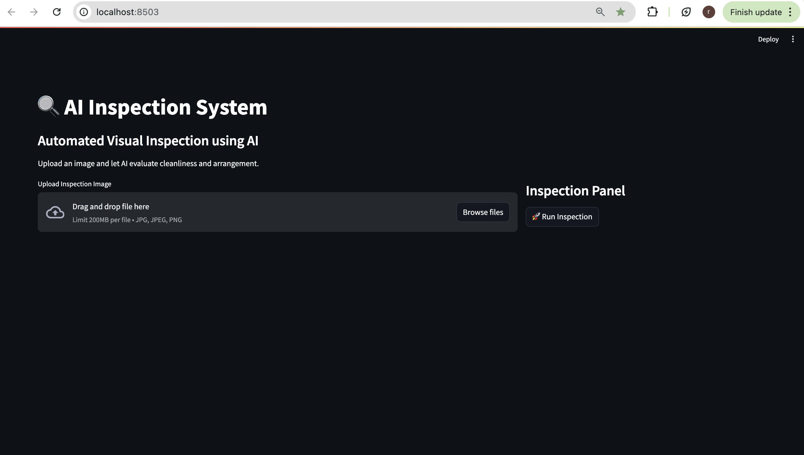
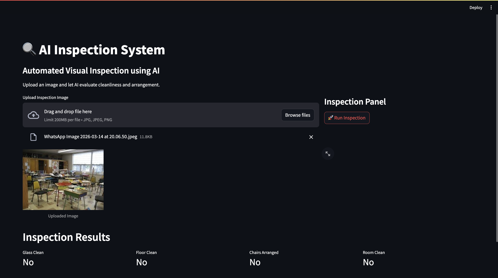

# 🔍 AI Inspection System

An AI-powered visual inspection system that analyzes uploaded images and evaluates cleanliness and object arrangement using **OpenAI Vision models and LangChain**.

The system provides automated inspection results through an interactive **Streamlit dashboard**.

---

##  Features

- Upload inspection images
- AI analyzes environment cleanliness
- Automated checklist evaluation
- Interactive Streamlit dashboard
- Docker-ready deployment

---

##  Tech Stack

- Python
- LangChain
- OpenAI Vision Model
- Streamlit
- OpenCV
- Docker

---

## 📂 Project Structure
ai-inspection-system
│
├── app
│ ├── chains
│ ├── models
│ ├── prompts
│ ├── services
│ └── ui
│
├── data
├── screenshots
├── requirements.txt
└── README.md


---

## 📸 Screenshots

### Dashboard



### Inspection Result



---

## ▶️ Run the Project

```bash
git clone https://github.com/ramaIAS2026/ai-inspection-system.git
cd ai-inspection-system

python3 -m venv .venv
source .venv/bin/activate

pip install -r requirements.txt
streamlit run app/ui/streamlit_app.py

#http://localhost:8501

#  Author

# Rama Devi Puppala
